# Trabalho Final

> [!NOTE]
> Repositório do trabalho final das matérias de:
>
> - Desenvolvimento Web Backend
> - Banco de Dados
> - Projeto Interdiciplinar I

## Descrição do projeto

Este projeto tem como objetivo desenvolver um Sistema de Automatização para Processos Judiciais, oferecendo suporte aos advogados na gestão e automação de processos jurídicos. O sistema permitirá adicionar novos pedidos de automatização e implementar funcionalidades específicas para otimizar o trabalho dos advogados. Este projeto integra conhecimentos adquiridos nas disciplinas de **Desenvolvimento Web Backend, Banco de Dados e Projeto Interdisciplinar I**.

## 📒 Disciplinas Envolvidas

### 🔸 Desenvolvimento Web Backend

- **Objetivo:**
  - Desenvolver a lógica de negócios, API e todos sistema de gerenciamento da aplicação.
- **Conteúdos Aplicados:**
  - Criação de APIs
  - Autenticação e autorização de usuários
  - Manipulaçãop de rotas

### 🔸 Banco de Dados

- **Objetivo:**
  - Projetar e implementar o banco de dados para armazenamento seguro e eficiente das informações dos processos judiciais e dos usuários.
- **Conteúdos Aplicados:**
  - Modelagem de dados - (Conceitual e lógico)
  - Implementação de banco de dados relacional usando PostgreSQL

[Diagramas - Conceitual e Lógico](./docs/diagramas-db/)

### 🔸 Projeto Interdisciplinar I

- **Objetivo:**
  - Planejar, gerenciar e documentar o desenvolvimento do projeto, assegurando boas práticas de engenharia de software
- **Conteúdos Aplicados:**
  - Planejamento e cronograma do projeto
  - Documentação e versionamento de código
  - Teste e validação do sistema

> [!IMPORTANT]
> 🔗 Link do vídeo: [Banco de Dados](https://teste.com)
> 🔗 Link do vídeo: [Desenvolvimento Web Backend](https://teste.com)
> 🔗 Link do repositório: <https://github.com/DevBrenoSantos/FinalProject>

---

### Tecnologias Usadas

### Bun:

Bun é um software de código aberto, composto por um runtime que permite a execução de códigos JavaScript fora de um navegador web, um gerenciador de pacotes, um empacotadom, e de uma ferramenta para execução de teste de software.
- **TypeScript:**
  
  TypeScript é uma linguagem de programação de código aberto desenvolvida pela Microsoft. É um superconjunto sintático estrito de JavaScript e adiciona tipagem estática opcional à linguagem.
- **HTML, CSS e JavaScript:**
  HTML, CSS e JavaScript são as tecnologias fundamentais que formam a base da web, cada uma desempenhando um papel único no desenvolvimento de áginas e aplicativos web. Escolhemos usá-lás pois juntas, elas permitem criar experiências de usuário ricas e interativas.
- **PostgreSQL:**
  O PostgreSQL é um sistema gerenciador de banco de dados relacional, desenvolvido como um projeto de código aberto.
- **ElephantSQL:**
  Serviço de hospedagem em nuvem para bancos de dados, especificamente para PostgreSQL.

### Funcionalidades da Aplicação

- Cadastrar nova empresa vinculada à plataforma.
- Cadastrar novos projetos a serem desenvolvidos.
- Login/Logoff
- Listar projetos em desenvolvimento e atualizar status

### Arquitetura Desenvolvida

**Arquitetura Monolítica**

Um aplicação monolítica descreve uma única aolicação de software em camadas no qual a interface de usuário e código de acesso aos dados são combinados em um único programa a partir de uma única plataforma.

Esquema simples de arquitetura monolítica:

```mermaid
graph LR;
  IU1(Interface do Usuário) --> Camada-de-Processamento((Camada de Processamento)) --> ID1(Interface de Dados) --> db1[(Banco de Dados)];
```

### Contribuidores do Projeto

<table>
  <tr>
    <td align="center">
      <a href="https://github.com/DevBrenoSantos" title="Github">
         
        
          <b>Breno Amaral Santos</b>
        
      </a>
    </td>
    <td align="center">
      <a href="#" title="Github">
         
        
          <b>Pedro Francisco Staino Santayana</b>
        
      </a>
    </td>
    <td align="center">
      <a href="#" title="Github">
         
        
          <b>Luigi Fernando Alves de Oliveira</b>
        
      </a>
    </td>
    <td align="center">
      <a href="#" title="Github">
         
        
          <b>Ana Luiza Carvalho</b>
        
      </a>
    </td>
  </tr>
</table>

### Licença

Este projeto está licenciado sob a MIT License - veja o arquivo [License](/LICENSE.txt) para mais detalhes.
